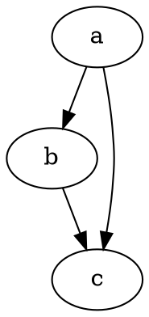

# remark-graphviz

[](https://npmjs.org/packages/remark-graphviz/)
[](https://travis-ci.org/temando/remark-graphviz)
[](https://en.wikipedia.org/wiki/MIT_License)

Replaces graphs defined in [`dot`](http://www.graphviz.org/content/dot-language)
with rendered SVGs.

## Installation

```sh
$ npm install remark-graphviz
```

## Usage

Graphs defined using `dot` can be referenced using a `dot:` title which will
generate an SVG image.

```md
[Link to a Graph](test/fixtures/assets/example.dot "dot:")

```

Alternatively, graphs can be generated inline, by using `dot` (or `circo`) as
the language identifier for a fenced code block.

<pre>

</pre>

See this project's [fixtures](test/fixtures) for more examples.

## Example

Given a file, `example.md`, which contains the following Markdown:

<pre>
# dot code block


</pre>

Using remark like follows:

```js
var vfile = require('to-vfile');
var remark = require('remark');
var graphviz = require('remark-graphviz');

var example = vfile.readSync('example.md');

remark()
  .use(graphviz)
  .process(example, function (err, file) {
    if (err) throw err;

    console.log(String(file))
  });
```

Will result in an SVG being written relative to `example.md`, and the Markdown
being transformed to:

```md
# dot code block


```

To change where the SVG's are written, set `data.destinationFilePath` on the
vFile. This following shows how you could process a file from one directory and
output the transformed file to another:

```js
var vfile = require('to-vfile');
var remark = require('remark');
var graphviz = require('remark-graphviz');

var example = vfile.readSync('example.md');
example.data = {
  destinationFilePath: 'out/example.md'
};

remark()
  .use(graphviz)
  .process(example, function (err, file) {
    if (err) throw err;

    vfile.writeSync({ path: file.data.destinationFilePath });
  });
```

Both `example.md` and the generated SVG will reside in the `/out` directory.
